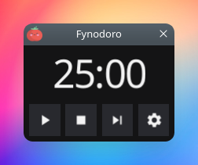
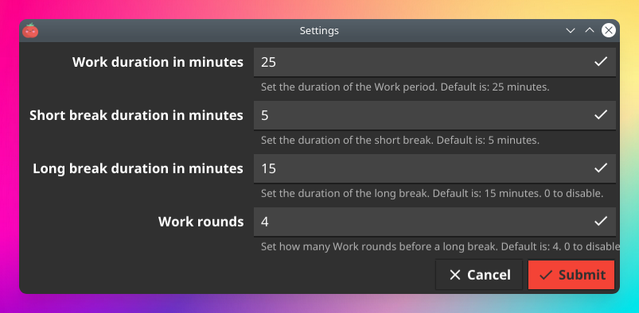

<p align="center" width="100%">
  
</p>

# Fynodoro is a tiny and cute Pomodoro Widget


<!-- START doctoc generated TOC please keep comment here to allow auto update -->
<!-- DON'T EDIT THIS SECTION, INSTEAD RE-RUN doctoc TO UPDATE -->
## Table of contents

- [Screenshots](#screenshots)
  - [Timer](#timer)
  - [Settings](#settings)
- [Features](#features)
- [Changelog](#changelog)
- [Configuration](#configuration)
  - [Notification sound](#notification-sound)
- [Install](#install)
  - [Install Ubuntu/Debian (.deb)](#install-ubuntudebian-deb)
  - [Install Fedora/Redhat (.rpm)](#install-fedoraredhat-rpm)
  - [Download Linux binaries](#download-linux-binaries)
- [Releasing the project](#releasing-the-project)
- [TODO & IDEAS](#todo--ideas)
- [Credits](#credits)

<!-- END doctoc generated TOC please keep comment here to allow auto update -->

## Screenshots

### Timer

<p align="center" width="100%">
    
</p>

### Settings

<p align="center" width="100%">
    
</p>

## Features

- ⏲️ Pomodoro Timer ✨
- 🗒️ Configurable: work duration, short break/long break, work rounds 🖊️
- 🏆 Small download size
- 💼 Releases for Ubuntu/Debian, Fedora/Redhat, and as linux binary

## Changelog

See the [Releases](https://github.com/tomsquest/fynodoro/releases) section on GitHub.

## Configuration

The Pomodoro technique defaults to 4 work rounds of 25 minutes, with a 5 minutes pause ("short break") in-between and a final 15 minutes pause (the "long" break), for a total of 2 hours (4x25m Work + 3x5m Short breaks + 1x15m Long break).

You can **configure**:

- the duration in minutes of the Work period (default: `25` minutes)
- the duration in minutes of the Short breaks (default: `5` minutes)
- the duration in minutes of the Long breaks (default: `15` minutes)
- the number of Work rounds before a long break (default: `4` rounds)

You can **disable** Long breaks by setting the duration of Long breaks to `0` or the number of work rounds to `0`. This will make the timer do a Work period, then a Short break, and so-on, and never do Long break.

You can **disable** Short breaks by setting the duration of Short breaks to `0`. This will make the timer do a Work period, then a Long break, and so-on, and never do Short break.

Tips: you can **disable** both Short and Long breaks by setting them to `0`. The timer will then act as a ticker, notifying you after each Work period.

### Notification sound

The notification sound is stored in: `/usr/share/fynodoro/notification.mp3`.  
You can override it if you wish with another **mp3** file.

## Install

### Install Ubuntu/Debian (.deb)

Latest: [](https://cloudsmith.io/~tomsquest/repos/fynodoro/packages/detail/deb/fynodoro/latest/a=amd64;d=any-distro%252Fany-version;t=binary/#install)

Add the repository and install Fynodoro:

```shell
curl -1sLf 'https://dl.cloudsmith.io/public/tomsquest/fynodoro/setup.deb.sh' | sudo -E bash
sudo apt install fynodoro 
```

_[Complete instructions at CloudSmith.io](https://cloudsmith.io/~tomsquest/repos/fynodoro/packages/detail/deb/fynodoro/latest/a=amd64;d=any-distro%252Fany-version;t=binary/#install)_

### Install Fedora/Redhat (.rpm)

Latest: [](https://cloudsmith.io/~tomsquest/repos/fynodoro/packages/detail/rpm/fynodoro/latest/a=x86_64;d=any-distro%252Fany-version;t=binary/#install)

Add the repository and install Fynodoro:

```shell
curl -1sLf 'https://dl.cloudsmith.io/public/tomsquest/fynodoro/setup.rpm.sh' | sudo -E bash
# Choose between:
sudo dnf install fynodoro
sudo yum install fynodoro
sudo microdnf install fynodoro
sudo zypper install fynodoro
```

_[Complete instructions at CloudSmith.io](https://cloudsmith.io/~tomsquest/repos/fynodoro/packages/detail/rpm/fynodoro/latest/a=x86_64;d=any-distro%252Fany-version;t=binary/#install)_

### Download Linux binaries

Latest: [](https://github.com/tomsquest/fynodoro/releases)

See the [Releases](https://github.com/tomsquest/fynodoro/releases) section for downloads.

## Releasing the project

Push a new tag from a clean master:

```shell
git checkout master && git pull
if ! [ -z "$(git status --untracked-files=no --porcelain)" ]; then 
  echo "Warning: there are some local changes"
fi
git fetch --all --tags
TAG=v1.0.0 && git tag $TAG && git push origin $TAG
# Publish Release draft: https://github.com/tomsquest/fynodoro/releases
```

## TODO & IDEAS

- [ ] Make the timer clickable (start/stop)
- [ ] Display the type of Pomodoro: Work/Short/Long
- [ ] Display the time left in the Tray (see [Fomato](https://github.com/andydotxyz/fomato)
- [ ] Resizable UI (scale timer and buttons with the window)
- [ ] Pico/Nano/Normal UI presets
- [ ] option for Dark/Light mode (what about Fyne global preferences?)
- [ ] option to disable notification popup
- [ ] option to change notification script
- [ ] Keyboard shortcuts
- [ ] Release Windows, macOS, Android, IOS versions

## Credits

- Fynodoro is built in Go, using the awesome [Fyne toolkit](https://fyne.io) for the UI
- [CloudSmith.io](https://cloudsmith.io) for hosting the packages
- [Go Releaser](https://goreleaser.com) for the release automation
- Icon made by [Freepik](https://www.freepik.com) from [Flaticon](https://www.flaticon.com/free-icon/tomato_877814)
- Screenshot pimped with [PrettySnap](https://prettysnap.app)
- Notification sound from [Zedge](https://www.zedge.net/ringtones)
