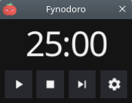

<p align="center">
  
</p>

# Fynodoro, the Pomodoro Widget




Fynodoro is a tiny and cute Pomodoro **Widget**.

## Features

- :rocket: it counts from 25:00 to 0! And then from 5:00 to 0! :zap:

## Changelog

See the [Releases](https://github.com/tomsquest/fynodoro/releases) section.

## Install

#### Downloads binaries

Latest: [](https://github.com/tomsquest/fynodoro/releases)

See the [Releases](https://github.com/tomsquest/fynodoro/releases) section for downloads.

#### Install Debian/Ubuntu (.deb)

Latest: [](https://cloudsmith.io/~tomsquest/repos/fynodoro/packages/detail/deb/fynodoro/latest/a=amd64;d=any-distro%252Fany-version;t=binary/#install)

Add the repository and install Fynodoro:

```shell
curl -1sLf 'https://dl.cloudsmith.io/public/tomsquest/fynodoro/setup.deb.sh' | sudo -E bash
sudo apt install fynodoro 
```

_[Complete instructions at CloudSmith.io](https://cloudsmith.io/~tomsquest/repos/fynodoro/packages/detail/deb/fynodoro/latest/a=amd64;d=any-distro%252Fany-version;t=binary/#install)_

#### Install Fedora/Redhat (.rpm)

Latest: [](https://cloudsmith.io/~tomsquest/repos/fynodoro/packages/detail/rpm/fynodoro/latest/a=x86_64;d=any-distro%252Fany-version;t=binary/#install)

Add the repository and install Fynodoro:

```shell
curl -1sLf 'https://dl.cloudsmith.io/public/tomsquest/fynodoro/setup.rpm.sh' | sudo -E bash
# Choose between:
sudo dnf install fynodoro
sudo yum install fynodoro
sudo microdnf install fynodoro
sudo zypper install fynodoro
```

_[Complete instructions at CloudSmith.io](https://cloudsmith.io/~tomsquest/repos/fynodoro/packages/detail/rpm/fynodoro/latest/a=x86_64;d=any-distro%252Fany-version;t=binary/#install)_

## Releasing the project

Push a new tag from a clean master:

```shell
git checkout master && git pull
if ! [ -z "$(git status --untracked-files=no --porcelain)" ]; then 
  echo "Warning: there are some local changes"
fi
git tag v1.3.0 && git push --tags
# Publish Release draft: https://github.com/tomsquest/fynodoro/releases
```

## TODO

- [ ] Pico/Nano/Normal UI
- [ ] Tons of options ( durations, work rounds...)
- [ ] Release Snap, Windows, macOS, Android versions

## Credits

- Icon made by [Freepik](https://www.freepik.com) from [Flaticon](https://www.flaticon.com/free-icon/tomato_877814)
- Screenshot pimped with [PrettySnap](https://prettysnap.app)
